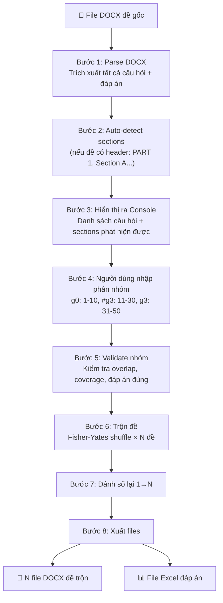
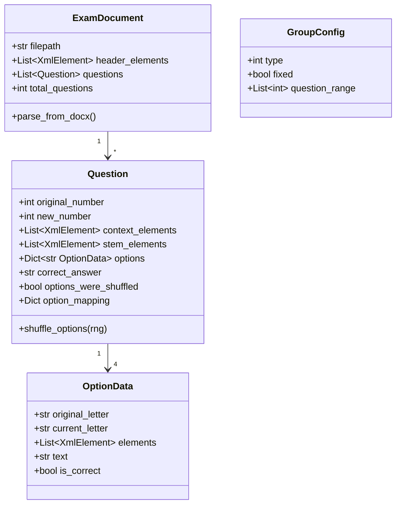

# Chương Trình Trộn Câu Hỏi — Implementation Plan v2

## 1. Tổng Quan

Chương trình Python đọc file DOCX đề thi gốc → parse câu hỏi → người dùng phân nhóm qua console → trộn đề theo quy tắc → xuất N file DOCX đề trộn + bảng đáp án.

**Đặc điểm quan trọng:**
- File DOCX gốc **không có tag** — câu hỏi rải liên tục từ 1→N
- Chương trình **tự phát hiện** sections (nếu có) + **người dùng xác nhận/override** qua console
- Đáp án đúng được nhận diện qua **formatting** (tô đỏ hoặc gạch chân)

---

## 2. Workflow Tổng Thể



---

## 3. Thuật Toán Chi Tiết

### 3.1. Bước 1 — Parse DOCX: Trích Xuất Câu Hỏi

**Input:** File DOCX
**Output:** Danh sách `Question` objects, mỗi object chứa đầy đủ paragraph elements gốc

#### Nhận diện câu hỏi

Duyệt paragraph-by-paragraph. Mỗi khi gặp paragraph match pattern bắt đầu câu hỏi → bắt đầu Question mới:

```python
QUESTION_PATTERNS = [
    r'(?:Câu|Question|Mark the letter)\s*(\d+)\s*[.:\)]',  # "Câu 1:", "Question 5."
    r'^(\d+)\s*[.:\)]\s',                                    # "1. ", "5: "
]
```

Tất cả paragraph từ lúc gặp pattern đến trước câu tiếp theo → thuộc câu hiện tại.

#### Nhận diện đáp án A/B/C/D

Trong các paragraph thuộc một câu hỏi, tìm đáp án:

```python
OPTION_PATTERNS = [
    r'^\s*([A-D])\s*[.)]\s+',      # "A. answer" hoặc "A) answer"
]
```

**3 trường hợp bố trí đáp án:**

| Trường hợp | Ví dụ | Nhận diện |
|------------|-------|-----------|
| Mỗi đáp án 1 paragraph | `A. Cat`<br>`B. Dog`<br>`C. Fish`<br>`D. Bird` | Mỗi paragraph match option pattern |
| Tất cả trên 1 paragraph | `A. Cat   B. Dog   C. Fish   D. Bird` | Tìm ≥3 option patterns trên cùng dòng |
| 2 đáp án/dòng | `A. Cat   B. Dog`<br>`C. Fish   D. Bird` | Tìm 2 option patterns/dòng, 2 dòng liên tiếp |

#### Nhận diện đáp án đúng (Formatting)

```python
def is_correct_answer_run(run) -> bool:
    """Kiểm tra 1 run có phải đáp án đúng không."""
    
    # 1. Kiểm tra màu đỏ (RGB trực tiếp)
    if run.font.color and run.font.color.rgb:
        r, g, b = run.font.color.rgb[0], run.font.color.rgb[1], run.font.color.rgb[2]
        if r > 180 and g < 100 and b < 100:  # Nhiều sắc đỏ
            return True
    
    # 2. Kiểm tra màu đỏ (Theme color - cần resolve từ XML)
    if run.font.color and run.font.color.theme_color:
        # Resolve theme color → RGB, rồi kiểm tra
        ...
    
    # 3. Kiểm tra gạch chân
    if run.font.underline is not None and run.font.underline is not False:
        return True
    
    return False

def detect_correct_option(question) -> str:
    """Tìm đáp án đúng trong câu hỏi. Trả về 'A'/'B'/'C'/'D'."""
    for letter, option_data in question.options.items():
        for paragraph in option_data.paragraphs:
            for run in paragraph.runs:
                if run.text.strip() and is_correct_answer_run(run):
                    return letter
    return None  # Không phát hiện được
```

> [!WARNING]
> **Edge cases cần xử lý:**
> - Đáp án chỉ có 1 từ được tô đỏ (không phải toàn bộ dòng) → vẫn coi là đáp án đúng
> - Bold + Red → vẫn nhận là đỏ
> - Theme color vs RGB color → cần resolve cả hai
> - Nếu KHÔNG phát hiện được đáp án đúng → cảnh báo user, câu đó sẽ không track đáp án

#### Nhận diện nội dung ngữ cảnh (Context)

Các paragraph **trước câu hỏi đầu tiên** hoặc **giữa các nhóm câu hỏi** mà không match question pattern → đây là "context" (đoạn văn đọc hiểu, hướng dẫn LISTENING, etc.):

```
Paragraph: "Read the following passage and answer questions 21-25"  ← CONTEXT
Paragraph: "The Amazon rainforest is the largest..."               ← CONTEXT  
Paragraph: "Question 21: What is the main idea..."                 ← QUESTION START
```

**Quy tắc gắn context:** Context paragraphs được gắn vào câu hỏi **ngay sau nó** (câu hỏi đầu tiên sau context). Khi trộn câu hỏi, context sẽ đi kèm.

> [!IMPORTANT]
> **Xử lý đặc biệt — Đoạn văn đọc hiểu:** Nếu context có dạng "Read... and answer questions X-Y", context này thuộc về **toàn bộ nhóm câu X→Y**, không chỉ câu X. Khi trộn, cả khối (context + câu X→Y) phải di chuyển cùng nhau như một đơn vị.

### 3.2. Bước 2 — Auto-Detect Sections (Nếu Có)

Dò tìm section headers trong document:

```python
SECTION_PATTERNS = [
    r'(?i)^(?:PART|SECTION|PHẦN)\s*(\d+|[IVX]+)',  # "PART 1", "Section II", "Phần 3"
    r'(?i)^(?:I|II|III|IV|V|VI|VII|VIII)\s*[.:]',    # "I.", "II:", Roman numerals
]
```

Nếu phát hiện section → gợi ý phân nhóm cho user. Nếu không → user tự nhập hoàn toàn.

### 3.3. Bước 3+4 — Console Interaction

**Hiển thị:**
```
╔══════════════════════════════════════════════════════════╗
║  📄 ĐỀ GỐC: de_thi_tieng_anh_hk1.docx                 ║
║  📊 Tổng số câu hỏi: 50                                ║
║  ✅ Đáp án đúng phát hiện: 48/50 câu                    ║
╚══════════════════════════════════════════════════════════╝

--- Danh sách câu hỏi ---
Câu 1:  What is the best title for...     [A] B  C  D    ← Đáp án đúng: A
Câu 2:  She ___ to school every day.      A [B]  C  D    ← Đáp án đúng: B
Câu 3:  Choose the synonym of "big":      A  B [C]  D    ← Đáp án đúng: C
...
Câu 50: Which sentence is correct?        A  B  C [D]    ← Đáp án đúng: D

⚠️  Câu 12, 35: Không phát hiện đáp án đúng (không có formatting đỏ/gạch chân)

--- Sections phát hiện tự động ---
 [Gợi ý] PART 1: LISTENING (Câu 1-10)
 [Gợi ý] PART 2: READING  (Câu 11-30)
 [Gợi ý] PART 3: WRITING  (Câu 31-50)

═══════════════════════════════════════════════════

📝 Nhập phân nhóm câu hỏi (Enter trống = tất cả g3):

Cú pháp: <nhóm>: <dải câu>  |  Thêm # để cố định vị trí
Ví dụ:   g0: 1-10
          #g3: 11-30
          g3: 31-50

> g0: 1-10
> #g3: 11-30
> g3: 31-50
> [Enter trống để kết thúc]

📝 Số lượng đề trộn cần tạo: 4
```

### 3.4. Bước 5 — Validate

```python
def validate_groups(groups, total_questions):
    """Kiểm tra phân nhóm hợp lệ."""
    all_questions = set()
    for group in groups:
        for q_num in group.question_range:
            if q_num in all_questions:
                raise f"Câu {q_num} bị trùng nhóm!"
            all_questions.add(q_num)
    
    # Kiểm tra coverage
    missing = set(range(1, total_questions+1)) - all_questions
    if missing:
        print(f"⚠️ Câu {missing} chưa được gán nhóm → mặc định g3")
```

### 3.5. Bước 6 — Thuật Toán Trộn

#### Thuật toán chính: Fisher-Yates Shuffle + Seed-based RNG

**Tại sao Fisher-Yates?**
- ✅ **O(n)** — hiệu quả nhất cho hoán vị ngẫu nhiên
- ✅ **Uniform distribution** — mọi hoán vị có xác suất bằng nhau
- ✅ **In-place** — không cần bộ nhớ thêm
- ✅ **Reproducible** — dùng seed để tái tạo nếu cần
- ✅ Python's `random.shuffle()` đã implement Fisher-Yates

```python
import random

def shuffle_exam(exam, group_configs, seed):
    """
    Trộn 1 đề từ đề gốc.
    
    Args:
        exam: ExamDocument đã parse
        group_configs: List[GroupConfig] từ user input
        seed: int - random seed cho reproducibility
    """
    rng = random.Random(seed)
    shuffled = deep_copy(exam)
    
    # ═══ BƯỚC A: Trộn bên trong mỗi nhóm ═══
    for group in group_configs:
        questions = [shuffled.questions[i-1] for i in group.question_range]
        
        if group.type == 0:  # g0: Không trộn gì
            pass
        
        elif group.type == 1:  # g1: Chỉ trộn thứ tự câu hỏi
            shuffle_questions_in_group(questions, rng)
        
        elif group.type == 2:  # g2: Chỉ trộn đáp án
            for q in questions:
                shuffle_options(q, rng)
        
        elif group.type == 3:  # g3: Trộn cả hai
            shuffle_questions_in_group(questions, rng)
            for q in questions:
                shuffle_options(q, rng)
        
        # Ghi lại vào shuffled exam
        for idx, q_num in enumerate(group.question_range):
            shuffled.questions[q_num - 1] = questions[idx]
    
    # ═══ BƯỚC B: Trộn vị trí giữa các nhóm (nếu có nhóm không cố định) ═══
    fixed_groups = [(i, g) for i, g in enumerate(group_configs) if g.fixed]
    movable_groups = [g for g in group_configs if not g.fixed]
    
    if len(movable_groups) > 1:
        rng.shuffle(movable_groups)
    
    # Ghép lại: fixed groups giữ nguyên slot, movable groups fill vào slots còn lại
    result_order = [None] * len(group_configs)
    for idx, group in fixed_groups:
        result_order[idx] = group
    movable_iter = iter(movable_groups)
    for i in range(len(result_order)):
        if result_order[i] is None:
            result_order[i] = next(movable_iter)
    
    # ═══ BƯỚC C: Sắp xếp lại câu hỏi theo thứ tự nhóm mới ═══
    final_questions = []
    for group in result_order:
        questions = [shuffled.questions[i-1] for i in group.question_range]
        final_questions.extend(questions)
    
    # ═══ BƯỚC D: Đánh số lại 1→N ═══
    for i, q in enumerate(final_questions):
        q.new_number = i + 1
    
    shuffled.questions = final_questions
    return shuffled
```

#### Shuffle Options (Hoán Vị Đáp Án)

```python
def shuffle_options(question, rng):
    """Hoán vị đáp án A/B/C/D, tracking đáp án đúng."""
    letters = ['A', 'B', 'C', 'D']
    option_values = [question.options[l] for l in letters]
    
    # Fisher-Yates shuffle
    rng.shuffle(option_values)
    
    # Gán lại
    old_correct = question.correct_answer
    for i, letter in enumerate(letters):
        question.options[letter] = option_values[i]
        if option_values[i].is_correct:
            question.correct_answer = letter  # Cập nhật đáp án đúng mới
    
    # Lưu mapping: đáp án mới → đáp án gốc (cho bảng đáp án)
    question.option_mapping = {
        letters[i]: option_values[i].original_letter 
        for i in range(4)
    }
```

#### Đảm Bảo Không Trùng Đề

```python
def generate_unique_exams(exam, group_configs, num_exams):
    """Sinh N đề trộn, đảm bảo mỗi đề khác nhau."""
    results = []
    seen = set()
    max_attempts = num_exams * 20  # Tránh infinite loop
    
    for attempt in range(max_attempts):
        if len(results) >= num_exams:
            break
        
        seed = random.randint(0, 2**32)
        shuffled = shuffle_exam(exam, group_configs, seed)
        
        # Fingerprint = tuple thứ tự câu gốc + thứ tự đáp án
        sig = compute_signature(shuffled)
        
        if sig not in seen:
            seen.add(sig)
            results.append(shuffled)
    
    if len(results) < num_exams:
        print(f"⚠️ Chỉ tạo được {len(results)}/{num_exams} đề khác nhau")
    
    return results

def compute_signature(exam):
    """Fingerprint để so sánh 2 đề."""
    parts = []
    for q in exam.questions:
        # Lưu: câu gốc số mấy + thứ tự đáp án
        opt_order = tuple(q.options[l].original_letter for l in 'ABCD')
        parts.append((q.original_number, opt_order))
    return tuple(parts)
```

### 3.6. Bước 7+8 — Xuất File DOCX

**Chiến lược: XML Deep Copy** — Clone toàn bộ paragraph elements gốc để giữ 100% formatting.

```python
from copy import deepcopy

def write_shuffled_docx(shuffled_exam, template_path, output_path):
    """Xuất 1 file DOCX đề trộn."""
    
    # 1. Mở template gốc (giữ styles, fonts, page setup)
    doc = Document(template_path)
    body = doc.element.body
    
    # 2. Xóa body content
    for child in list(body):
        body.remove(child)
    
    # 3. Clone header paragraphs (tiêu đề đề thi, họ tên, SBD...)
    for para_elem in shuffled_exam.header_elements:
        body.append(deepcopy(para_elem))
    
    # 4. Clone từng câu hỏi theo thứ tự mới
    for question in shuffled_exam.questions:
        # Clone context (đoạn văn đọc hiểu, nếu có)
        for ctx_elem in question.context_elements:
            body.append(deepcopy(ctx_elem))
        
        # Clone stem (thân câu hỏi) — thay số câu
        for stem_elem in question.stem_elements:
            cloned = deepcopy(stem_elem)
            replace_question_number(cloned, question.new_number)
            body.append(cloned)
        
        # Clone options
        for letter in ['A', 'B', 'C', 'D']:
            opt = question.options[letter]
            for opt_elem in opt.elements:
                cloned = deepcopy(opt_elem)
                replace_option_letter(cloned, letter)
                
                # Xử lý formatting đáp án đúng
                if question.options_were_shuffled:
                    # Đáp án bị trộn → cần reformat
                    if opt.is_correct:
                        apply_correct_formatting(cloned)   # Tô đỏ/gạch chân
                    else:
                        remove_correct_formatting(cloned)  # Xóa đỏ/gạch chân
                # else: không trộn đáp án → giữ nguyên formatting gốc
                
                body.append(cloned)
    
    doc.save(output_path)
```

#### Xuất Bảng Đáp Án Excel

```
╔══════╦══════════╦══════════╦══════════╦══════════╗
║ Câu  ║ Đề gốc   ║ Mã 001   ║ Mã 002   ║ Mã 003   ║
╠══════╬══════════╬══════════╬══════════╬══════════╣
║  1   ║    B     ║    C     ║    A     ║    D     ║
║  2   ║    A     ║    D     ║    B     ║    A     ║
║ ...  ║   ...    ║   ...    ║   ...    ║   ...    ║
╚══════╩══════════╩══════════╩══════════╩══════════╝
```

---

## 4. Cấu Trúc Dữ Liệu



---

## 5. Xử Lý Edge Cases

### 5.1. Câu Hỏi Gắn Liền Đoạn Văn (Reading Comprehension)

```
"Read the passage and answer questions 21-25"     ← context
"The Amazon rainforest..."                         ← context
"Question 21: What is the main idea?"              ← question
"Question 22: The word 'it' refers to..."          ← question
```

**Giải pháp:** Phát hiện context paragraph có chứa pattern "questions X-Y" hoặc "câu X-Y":
```python
CONTEXT_RANGE_PATTERN = r'(?:questions?|câu)\s*(\d+)\s*[-–to]\s*(\d+)'
```

Nếu phát hiện → tạo **QuestionBlock** gồm context + các câu X→Y. Khi trộn, cả block di chuyển cùng nhau.

### 5.2. Đáp Án Trên Cùng Dòng vs Dòng Riêng

Chương trình cần xử lý cả 3 kiểu bố trí đáp án (chi tiết ở mục 3.1). Đặc biệt quan trọng khi clone XML — nếu 4 đáp án trên cùng 1 paragraph, cần **tách run** rồi sắp xếp lại khi trộn.

### 5.3. Câu Không Có Đáp Án Đúng Rõ Ràng

Nếu không phát hiện formatting đỏ/gạch chân ở bất kỳ đáp án nào → cảnh báo user, cho phép user nhập thủ công đáp án đúng qua console.

### 5.4. Hình Ảnh Trong Câu Hỏi

Hình ảnh nằm trong paragraph element → khi deep copy XML, hình ảnh sẽ được copy theo (vì nó là `<w:drawing>` element con). Cần đảm bảo image relationships cũng được copy.

---

## 6. Cấu Trúc Thư Mục

```
TronCauHoi/
├── main.py              # Entry point CLI (chạy toàn bộ pipeline)
├── models.py            # Data classes — debug: in cấu trúc mẫu
├── parser.py            # Parse DOCX — debug: parse 1 file, in kết quả chi tiết
├── shuffler.py          # Shuffle — debug: trộn 1 đề mẫu, in signature
├── writer.py            # Xuất DOCX — debug: xuất 1 file test
├── console_ui.py        # Console UI — debug: hiển thị mẫu, test input
├── requirements.txt     # python-docx, openpyxl, lxml
├── input/               # Folder mặc định chứa đề gốc
└── output/              # Folder mặc định chứa đề trộn
```

### Debug: Chạy Từng Module Độc Lập

Mỗi file đều có `if __name__ == "__main__"` để test riêng:

```bash
# Bước 1: Test parse DOCX
python parser.py input/de_goc.docx

# Bước 2: Test hiển thị console
python console_ui.py input/de_goc.docx

# Bước 3: Test shuffle (cần config nhóm)
python shuffler.py input/de_goc.docx "g3: 1-50" --num 4

# Bước 4: Test xuất DOCX
python writer.py input/de_goc.docx --test

# Bước 5: Chạy full pipeline
python main.py input/de_goc.docx
```

---

## 7. Dependencies

```
python-docx>=0.8.11    # Đọc/ghi DOCX
openpyxl>=3.1.0        # Xuất Excel đáp án
lxml>=4.9.0            # XML manipulation (đi kèm python-docx)
colorama>=0.4.6        # Console colors (optional, cho đẹp)
```

---

## 8. Verification Plan

### Automated Tests
1. **test_parser**: File DOCX mẫu → parse → assert đúng số câu, đúng đáp án, đúng formatting
2. **test_shuffler**: Trộn 5 đề → assert không trùng signature, đáp án đúng vẫn đúng
3. **test_writer**: Xuất DOCX → parse lại → assert nội dung khớp

### Manual Verification
1. Tạo file DOCX mẫu nhỏ (10 câu) → chạy trộn → mở bằng Word kiểm tra formatting
2. So sánh bảng đáp án với đề trộn bằng tay

---

## 9. Open Questions

> [!IMPORTANT]
> **Không còn câu hỏi blocking.** Plan đã đủ chi tiết để bắt đầu implement. Nếu bạn đồng ý, tôi sẽ bắt đầu code.
